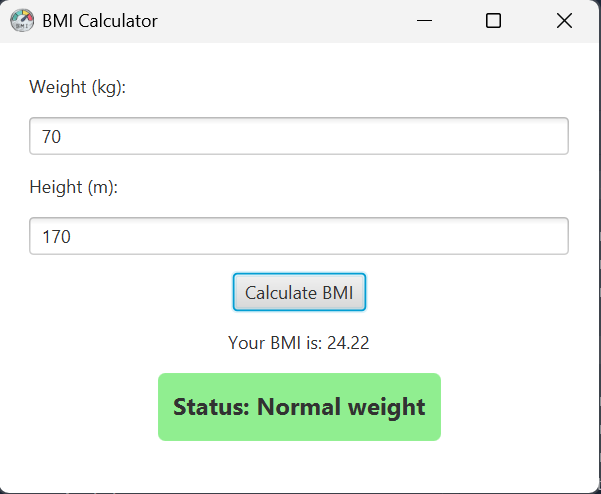

# BMI Calculator - JavaFX GUI Application

<div style="text-align: center;">
    
</div>

## Deskripsi

Aplikasi BMI Calculator berbasis JavaFX yang sederhana untuk menghitung Body Mass Index (BMI) berdasarkan berat badan dan tinggi badan pengguna. Aplikasi ini menampilkan hasil BMI beserta status kategori berat badan (Underweight, Normal weight, Overweight, Obesity) dengan tampilan GUI yang responsif dan mudah digunakan.

---

## Struktur Proyek

```bash
com.bmi
├── Main.java # Entry point aplikasi, setup stage dan scene
├── BMICalculatorView.java # UI layout dan logika input/output BMI
├── Person.java # Model data Person dengan logika perhitungan BMI
└── contracts
└── InnerPerson.java # Interface kontrak untuk kelas Person

com.bmi.utils
├── IconLoader.java # Utility untuk memuat ikon aplikasi
└── RootBackground.java # Utility untuk mengatur background root layout
```

---

## Cara Menjalankan Aplikasi

1. Pastikan Java dan JavaFX SDK telah terpasang di sistem Anda.
2. Buka folder `bmi-calculator` di terminal.
3. Jalankan perintah `mvn clean package` untuk kompilasi proyek.
4. Jalankan perintah `mvn javafx:run@bmi` untuk menjalankan aplikasi.

---

## Cara Menggunakan

-   Masukkan berat badan dalam kilogram pada kolom "Weight (kg)".
-   Masukkan tinggi badan dalam meter pada kolom "Height (m)".
    > Jika memasukkan nilai lebih dari 10 (misal 170), aplikasi akan otomatis mengonversi ke meter (1.70).
-   Klik tombol **Calculate BMI**.
-   Hasil BMI dan status berat badan akan muncul di bagian bawah.
-   Jika input tidak valid, akan muncul dialog error.

---

## Logika Perhitungan BMI

Rumus BMI:

> BMI = berat (kg) / (tinggi (m) × tinggi (m))

Kategori BMI:

-   `Underweight`: BMI < 18.5
-   `Normal weight`: 18.5 ≤ BMI < 24.9
-   `Overweight`: 25 ≤ BMI < 29.9
-   `Obesity`: BMI ≥ 30

---

## Penjelasan Kelas Utama

### `Main.java`

-   Memulai aplikasi JavaFX.
-   Menyiapkan scene dan stage.
-   Menggunakan `BMICalculatorView` sebagai root UI.

### `BMICalculatorView.java`

-   Mengatur UI menggunakan `VBox`.
-   Memuat label, input fields, tombol kalkulasi, dan label hasil.
-   Menangani event klik tombol, validasi input, dan menampilkan hasil BMI dan status.
-   Memberikan feedback warna sesuai status BMI.

### `Person.java`

-   Model data dengan properti berat dan tinggi.
-   Mengimplementasikan logika perhitungan BMI dan penentuan status berat badan.

### `IconLoader.java`

-   Memuat ikon aplikasi dari resources.

### `RootBackground.java`

-   Memberikan latar belakang putih untuk root layout.

### `InnerPerson.java`

-   Interface yang mendefinisikan kontrak kelas Person.

---

## Deployment Aplikasi
1. Pastikan JavaFX SDK & JMods telah terpasang di sistem Anda.  
   Jika belum ada, bisa download dari:

    - [JavaFX SDK & JMods (Gluon)](https://gluonhq.com/products/javafx/)

2. Buat folder `launch-app`.

3. Jalankan perintah ini untuk membuat runtime JavaFX custom:

    ```bash
    jlink --module-path "D:\Program Files\JavaFx\JavaFx-21-JMods;D:\Program Files\JavaFx\JavaFx-21-SDK\lib" \
          --add-modules java.base,javafx.controls,javafx.fxml,javafx.graphics,javafx.web,javafx.media,javafx.swing \
          --output runtime
    ```

4. Jalankan perintah ini untuk membuat aplikasi exe:
    ```bash
     jpackage --input target \
          --name Bmi-Calculator \
          --main-jar bmi-calculator-1.0.jar \
          --main-class com.bmi.Main \
          --type exe \
          --icon .\src\main\resources\icon\bmi.ico \
          --runtime-image runtime \
          --win-shortcut \
          --win-menu \
          --dest .\launch-app\
    ```
